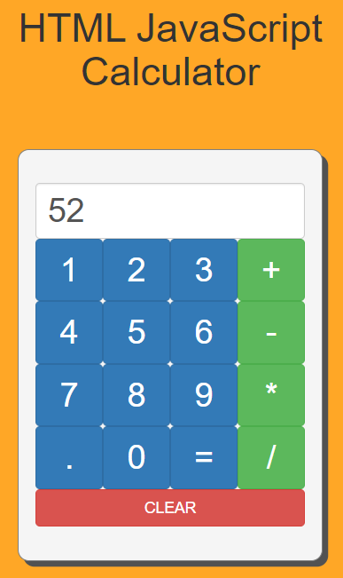
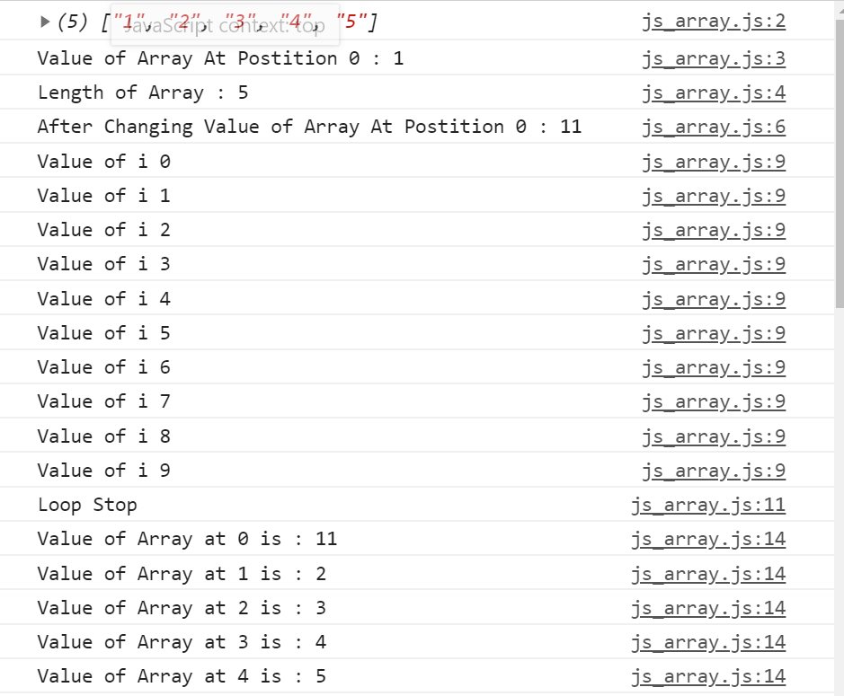
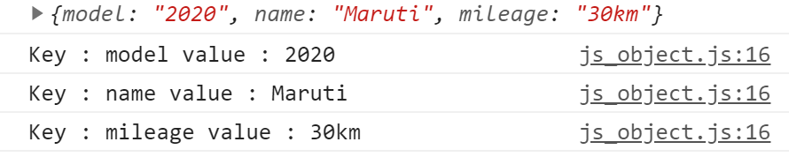
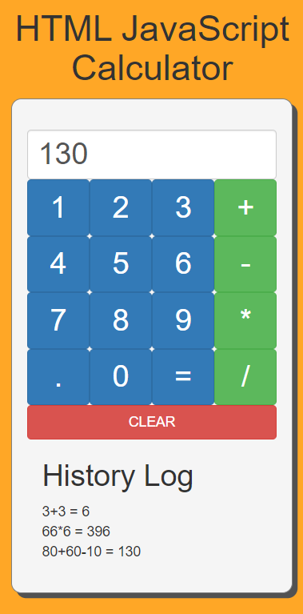
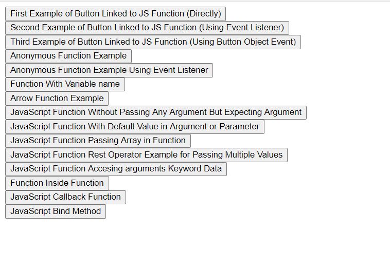
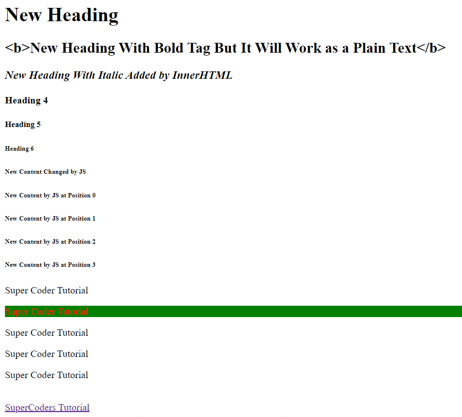
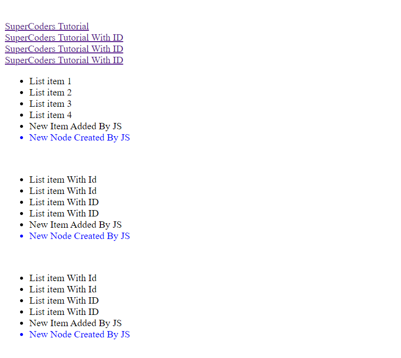
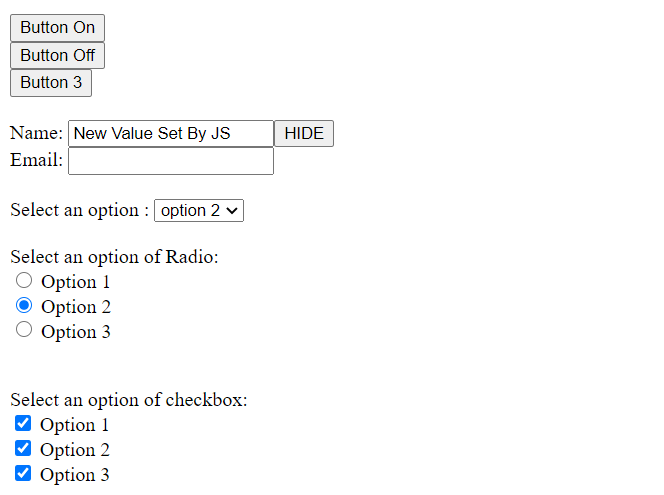
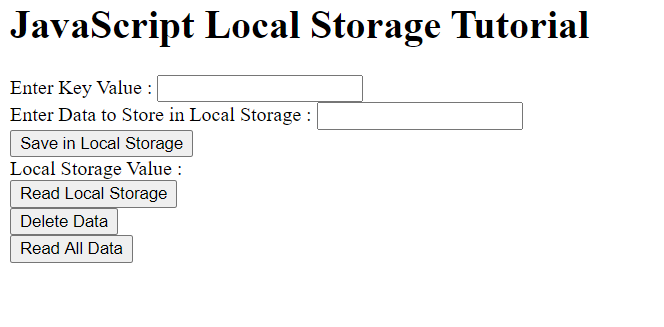
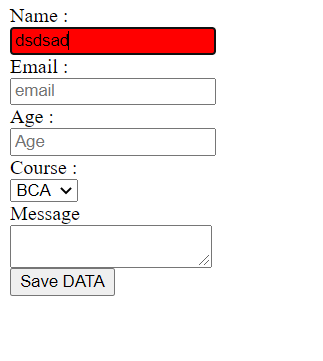

# JavaScriptCompleteTutorial

JavaScriptCompleteTutorial

Added Basic Example 
Added Variable Declaration 
Added Datatype  
Added Function Tutorial 
Added Calculator Made Using HTML,Bootstrap,JavaScript  
  

<h4>Added JavaScript Array Tutorial</h4>  
 

 
 
<h4>Added JavaScript Objects Tutorial</h4>  

## Added Calculator With Log Using JavaScript Objects and Array.

.

## Added JavaScript Complete Function Tutorial From Basic to Advance.

.

## Added JavaScript DOM Selector Change Property and Values.

 
 
 

## Added JavaScript Local Storage Tutorial.

## Added JavaScript Validation.

## For Ajax Tutorial Follow This Repo.

<a href="https://github.com/hackstarsj/JavaScriptAjaxCompleteTutorial">JavaScript Ajax Tutorial</a>

## Added JavaScript Complete Array Reference Tutorial

<pre>
1. How to Create Array in JavaScript

2. How to Access Item From Array in JavaScript

3. How to Access Last Item from Array in JavaScript

4. How to Access All Items from Array Using for Loop in JavaScript

5. How to Create Array of Objects in JavaScript

6. How to Access Array of Objects Item in JavaScript

7. How to Create 2D Array in JavaScript

8. Simple Program to Sum of 2D Array in JavaScript

9. How to Access 2D Array Item in JavaSCript

10. JavaScript Array Push Method 

10. JavaScript Array Pop Method

10. JavaScript Array Shift Method

10. JavaScript Array Unshift Method

11. JavaScript Array Splice Method Explanation

12. JavaScript Array Slice Method Explanation

13. How to Copy Data from Array in JavaScript

14. JavaScript Array Copy Data vs Copy Reference

15. JavaScript Use of indexof Method

16. How to Find Index of Item in Array in JavaScript

17. How to Find Object from Array of Object in JavaScript

18. JavaScript Array find Method

19. JavaScript Array findIndex Method

20. JavaScript Object Find Index in Array

21. JavaScript lastIndex of Method

22. JavaScript Array for Each Method

23. JavaScript Array .map() Method to Work With Each Item of Array

24. JavaScript Array .sort() Method

25. JavaScript Array Sort Object Data using .sort() Method

26. JavaScript Array Custom Sort for Objects

28. JavaScript Array .reverse() Method

29. How to Sort Item in Reverese Order of Array in JavaScript

30. Create a Simple Program for Sorting and Filter Data of Food

31. Sort Table Data in HTML JavaScript Using .sort() Method

32. JavaScript .includes() Method Example

33. JavaScript Array .filter Method Example

34. How to Use Filter Method in JavaScript Array

35. JavaScript Array Use of Spread Operator (...)

36. Spread Operator Example in JavaScript (...)

37. Copy Array Data Using Spread Operator (...)

38. Pass Data in Function Using Spread Operator (...)

39. Array Destruction in JavaScript

40. What is The Advantage of Using Array Destruction in JavaScript

41. Access Item of Array in Variable Using Array Destruction

42. JavaScript Convert String to Array

43. JavaScript Convert Array to String
</pre>
