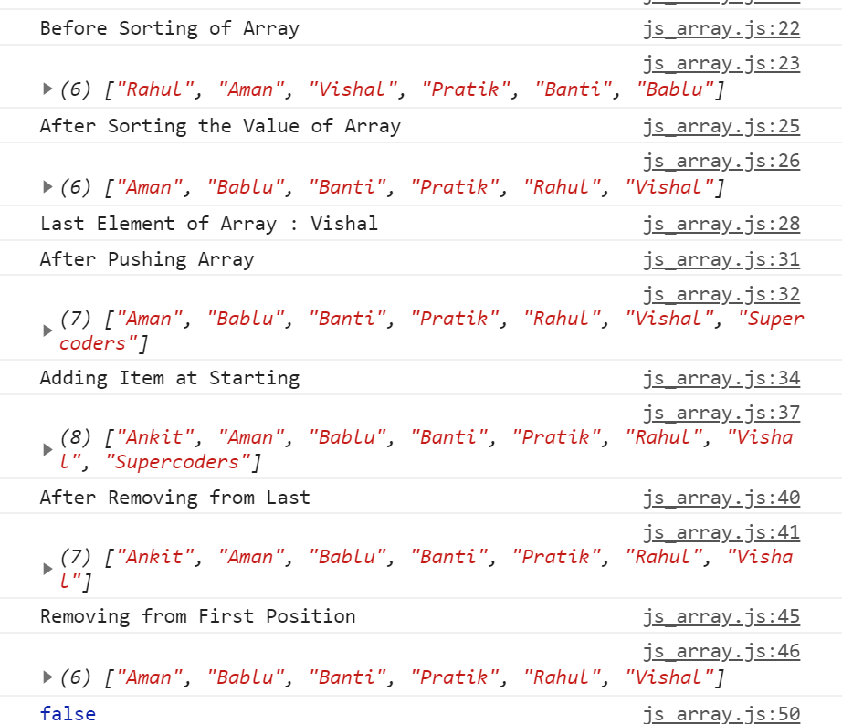

# JavaScriptCompleteTutorial
JavaScriptCompleteTutorial

Added Basic Example 
Added Variable Declaration 
Added Datatype  
Added Function Tutorial 
Added Calculator Made Using HTML,Bootstrap,JavaScript  
  

<h4>Added JavaScript Array Tutorial</h4>  
 

 
 
<h4>Added JavaScript Objects Tutorial</h4>  

##Added Calculator With Log Using JavaScript Objects and Array.

.